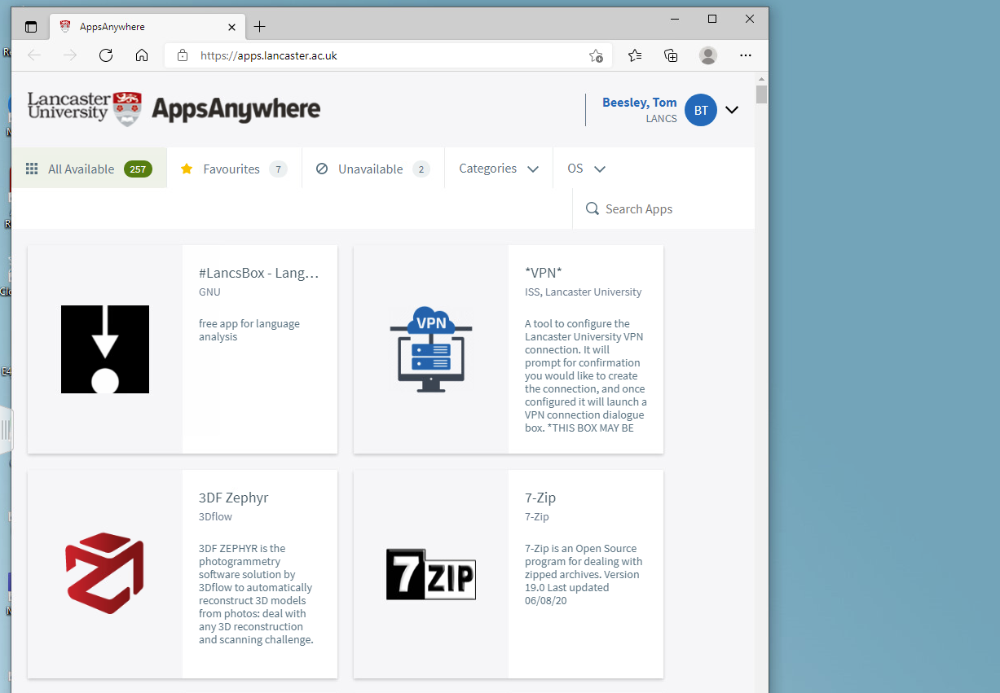
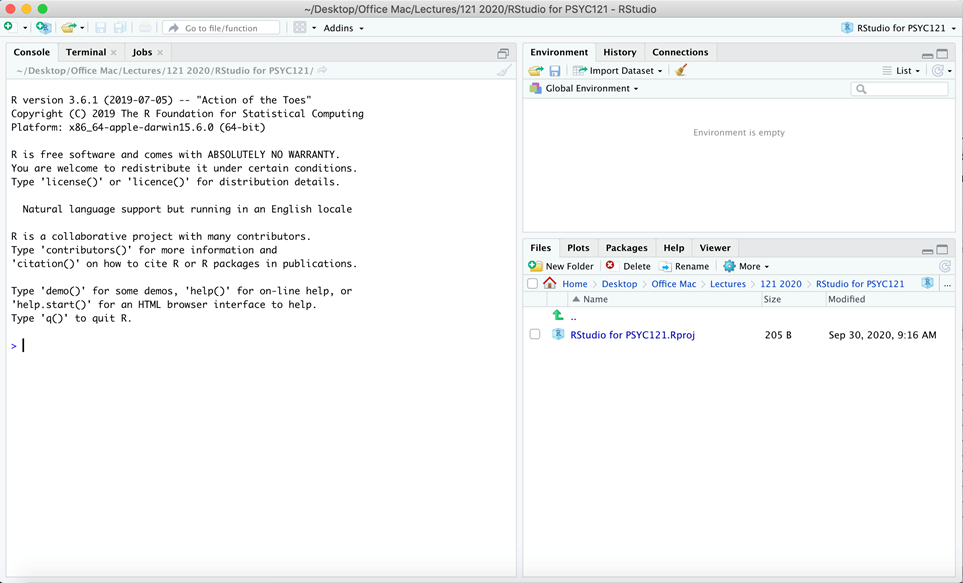

# Week 1 - Introduction to R Studio

The exercises in this section are designed to familiarise you with working in R Studio.

## Lab Work

### Introducing RStudio

R and RStudio is the software that we will be using to explore and learn about analysis in your Psychology degree. It’s a computational engine: a very snazzy calculator that you should see as your friend and ally in the journey to understand and appreciate psychology. It sits alongside what we teach about the concepts and interpretation of statistical analysis. R is the core software, RStudio is the interface for interacting with it.

Like even a simplest calculator, it just does what you ask (at least when you ask nicely!) but it requires the user to know what they want from it and to understand what it is telling you. A calculator can’t help a kid get the right answer to a multiplication problem if they don’t know the difference between multiplication and division and addition etc. And whilst a calculator is brilliant at doing the number crunching (and as a bonus, RStudio can help with turning the numbers into beautiful graphs and images too), even a calculator requires a thoughtful person to take the answers and make sensible interpretations from them. Therefore, we need to learn both about the concepts of statistical analysis on the one hand, and the processing of statistical information -through R- on the other. Over the next year, in these labs we will increasingly be using RStudio to focus on the latter, processing side, which will allow you to focus your energies on the conceptual side and its relevance for appreciating psychology.

### Getting started with R Studio {#getting_started}

For Lancaster University Psychology Students, we recommend using the virtual lab installation, through which you create a PC-in-a-web browser and can then use R Studio through AppsAnywhere: https://mylab.lancaster.ac.uk/ Connect to a "LU Windows 10 Lab". Once you've logged on to this virtual desktop, you should be presented with the AppsAnywhere window:

Search for "R Studio" and click launch. When RStudio starts, it will look something like this:

We also recommend that you set up your University "H drive" by [following the instructions here](https://answers.lancaster.ac.uk/display/ISS/Personal+filestore+%28H+drive%29+help)

If you do this, you can organise your files in one place and access them from any university computer that you log in to, including the lab machines in the Levy Lab and the virtual machine (see above). So this effectively acts as a free, cloud-based storage solution for your work (and even personal stuff). 

### File organisation

However you choose to store your files, it's essential that you are careful about file organisation. As you progress through these exercises, you will find yourself downloading many data files, and creating many R scripts. Consider each week a new set of materials that should have it's own folder. Get used to organising your work and you will be well placed to revise the material at a later date.


### Let's do something!

In the console window on the left hand side, there’s a command prompt ">". This is where we ask RStudio to do our bidding! 

1. Click in the console window and we will get R to work as a calculator. Type in:

```{r eval=FALSE}
5 + 5
```

and press enter. You should get the answer (amazing huh? OK, maybe not *that* amazing...). Use your imagination – ask a simple arithmetic question of your own choosing!

2. In the first analysis lecture, we looked at measures of central tendency and how to calculate them. So let’s get R to do these calculations also!

First, we tell R about the data from the lecture. Copy the following line and paste it into the console, then press enter to run it:

```{r eval=FALSE}
lecture1_data <- c(7,8,8,7,3,1,6,9,3,8)
```

This creates an "object" called "lecture1_data". We can then perform calculations on this object. For example, we can find the mean by using the following command (again, copy and paste)

```{r eval=FALSE}
mean(lecture1_data)
```

Check the answer is the same we found in the lecture (6!).

Next, let’s ask for the median:

```{r eval=FALSE}
median(lecture1_data)
```

This also should be the answer from the lecture (7)

R doesn’t have a single corresponding command for the *mode*, but we can use this series of commands:

```{r eval=FALSE}
getmode <- 
  function(lecture1_data) {
    uniqv <- unique(lecture1_data)
    uniqv[which.max(tabulate(match(lecture1_data, uniqv)))]
    }

getmode(lecture1_data)
```

This is just a bit of clever jiggery-pokery that gets the mode.

### Extra content

The commands above are designed to show you that with RStudio active, you can get quick and accurate answers to material covered in PSYC121 lectures.

All we have asked is that you write (or copy in) text to get the information. However, after the lab, you could play around with RStudio in your own time and think about the following:

In R, “<-“ is the assignment operator as in the command we used:

```{r eval=FALSE}
lecture1_data <- c(7,8,8,7,3,1,6,9,3,8)
```

We create the variable label on the left (lecture1.data) and we give it those number on the right. The name lecture1.data is largely arbitrary: try use a variable of your own naming (your own name?) instead - and then use that alternative name for the other commands. 

What does that tell you about the text used to get the mode? Can you figure out what each line does?

Also, once you have created a variable, you can check what the variable comprises by calling it at the command line. Just write its name, and R should respond with all the data points (all the X values it knows about). Take note that, as you write the variable label, R studio should offer to “auto-complete” the name. It only does that if it you have defined the variable, or are writing a known command.

