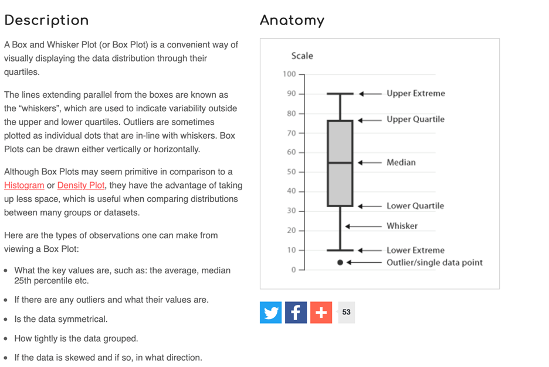

# Descriptive statistics (Week 2)

## Pre-lab work

Much of what a psychologist does involves numbers. For example, we:

* Measure behaviour in terms of numbers 
*	Use these numbers to provide summaries that indicate similarities and differences between different conditions (e.g., collections of male and female data used to examine gender differences). 
*	Analyse the raw data or the summaries to determine if there are “real” differences between our experimental conditions. 
*	Interpret the final numbers from an analysis in order to extract the underlying psychological differences. 

It should be obvious from the above that we need detailed information about what numbers mean, how to collect numbers, how to treat numbers and how to analyse numbers. In this lab we will start you along this journey. Let's start by recapping some important concepts from last week:

1. List the 4 types of measurement scales and for each give an example of how they might be used in psychology. 

2. For each of the types of numbers below give the scale of measurement, justifying your answer. 
  +  Temperature in centigrade 
  +  The number of children who point at a visual stimulus
  +  The number of errors made by each participant in a word reading task
  +  The rank attractiveness of each of 10 faces
  +   The time it takes to process read sentences
3.
  +  What is the name given to a bell-shaped distribution?
  +  A distribution that is asymmetrical with a long tail that extends towards high numbers is called a  ___________________ skewed distribution. 
  +  A distribution with two peaks is called a ____________________ distribution. 


## R Studio tasks

For a reminder of how to load R Studio see the section [Getting started with R Studio] 

Once you have accessed R Studio (and ideally setup your H drive), download the data file for this week, which is called [penelope.csv](files/Week_2/penelope.csv), and the accompanying [R script](files/Week_2/PSYC121_week_2_script.R) which we will use later. 

### How much does the cow weigh? (Task 1)

Some 5 years ago, a large group of participants gave an estimate of the weight of Penelope the cow. Just over 17,000 guesses. And the distribution of guesses was something like this:

What we can see from this graph is that:

1. Guesses formed a roughly normal distribution. There is a bit of a skew with a right0hand tail, but this is inevitable as a weight of less than 0 is physically impossible, but there is no limit of the semantics of a large guess.
2. The mean guess weight (1,287 lbs) is very close to the actual (true) weight of the cow (1,355 lbs). So even though lots of people were inaccurate, a central tendency measure has a pretty good alignment with te true weight. This is known as the Wisdom of Crowds phenomenon, first identified by Galton in 1907 (though he suggested using the median weight)

Let’s look at the PSYC121 student data collected on guessing the weight of Penelope, and ask whether it resembles the properties of this large dataset.

### Finding the correct folder

...we need something here about navigating to the folder and setting the working directory

### Using the R script

Let's start working with our data, by opening up the "PSYC121_week_2_script.R" file. This is "an R script" that contains a series of commands. We could type each of these in the console window (like we did in Week 1), but by having them in a script like this, it saves us typing them or copying and pasting them into the console. It also means we have a record of all the commands we have run.

The first command is loads a library of functions:

```{r eval =FALSE}
library(tidyverse)
```

To run this, simply click anywhere on line 1 to put the cursor there, and press ctrl+enter (cmd+enter on a mac) or click the button called run. You will see a number of messages appear in the console. Don't worry about these, or worry too much about what exactly this command is doing. Essentially this is giving us some useful tools for our analysis. We will introduce the features of the **tidyverse** gradually during this course.

Let’s now get our "weight guessing data" into RStudio. After we have loaded the tidyverse library, we can then use the `read_csv()` command to read in the dataset:

```{r eval=FALSE}
penelope <- read_csv("penelope.csv")
```

Have a quick look at the data you have just imported / loaded. To do so, at the command line just write

```{r eval=FALSE}
penelope
```

and the data will be reported. Note that “NA” means not available or missing data. Does this file structure make some sense to you?

### Finding the mean and median estimates

Use the data to answer the following questions...

1.	What is the mean weight estimates?
2.	What is the standard deviation of the estimates?
3.	What range of estimates encompasses 2 standard deviations around the mean?
4.	What is the median weight of the estimates?
5.	Which of these central tendency measures is the more accurate measure of the true cow weight?
6.	What is the mean weight estimate (and standard deviation) for female respondents and non-female (male and non-binary) respondents?

You may be thinking, how do I possibly do any of this?! Well this week all the commands you need are contained in the R script you have downloaded. Also, remember from last week, we explored the R command:

```{r eval=FALSE}
mean(lecture1_data)
```

That gave us the mean of the small dataset “lecture1_data”. This time, we want to explore the Penelope dataset. But also, the lecture_data was just a single list of numbers. The Penelope file is more like a datasheet. So we need to tell RStudio which **column** we are interested in. RStudio uses the format **data$column**. Hence, we can ask

```{r eval = FALSE}
mean(penelope$estimate) 
```

and to get a standard deviation we can use the command: 

```{r eval = FALSE}
sd(penelope$estimate)
```

So from this, can you work out what you would do to get the median value (remember from last week how we got the median value?). Add this command to your script, run it to get the median value, and save the file. 

### Referencing columns

We have seen that:

```{r eval = FALSE}
mean(penelope$estimate) 
```

will provide a mean of the column "estimate". In the third column, named "fweight", we have the estimates of just the female respondents. In the fourth column, named "oweight", we have the estimates of the "other" respondents (males and non-binary).

So can you now figure out how you might get information about the other columns, such as the female data (only) or the non-female data? Try it, based on what you have just done. Does it work?

You will find that the result of the this command produces an "NA" result. This means that the answer is "Not Available", or in other words, is a "missing value". This is because some of the values in this  column are NA, and the mean of a column with NAs will always lead to the result NA.

Instead, try this command:

```{r eval = FALSE}
mean(penelope$fweight, na.rm = TRUE )
```

Any different? The `na.rm = TRUE` instruction tells RStudio that missing data can be ignored in this mean calculation. (in technical language, `na.rm` is a parameter of the function `mean` that removes the NAs if set to TRUE)

### evaluating the range of estimates

mean +/- 2 SDs exercise...

JOHN - this probably needs a bit more intro here - asking a bit too much at this stage?
Q3 and Q5 above ask you to think about and process what R Studio tells you from the other commands you are using. The information comes from elsewhere in the activities you have done

### simple graphs
RStudio can be used to create graphical data plots that can help interpret datasets

The first thing we can do is create a histogram distribution of guesses from the sample student data to compare with the previous large sample study (i.e. the 17,000 guesses):

```{r eval=FALSE}
hist(penelope$estimate)
```

We can also create a "box and whisker plot". Here’s a general simple description of a box-and-whisker plot as a graphical representation of data:



We can create a box and whisker plot for the estimate column using the following command:

```{r eval = FALSE}
boxplot(penelope$estimate)
```


