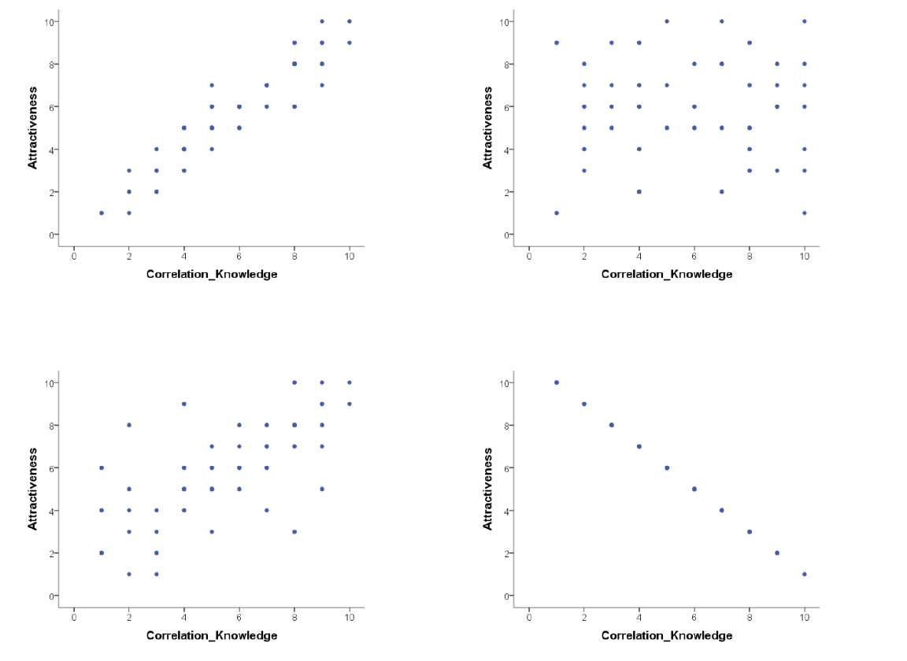

# Lab activity (Week 11)

## Pre-lab work

### Online tutorial

### R Studio prep work

Download the file [MillerHadenData.csv](files/Week_11/MillerHadenData.csv), and [122_wk11_labActivity.R](files/Week_11/122_wk11_labActivity.R) 

### Conceptual prep work

[Click here for a basic web app](https://www.rossmanchance.com/applets/GuessCorrelation.html) that will test how good you are at recognising different correlation strengths from the scatterplots. We would recommend you click the “Track Performance” tab so you can keep an overview of your overall bias to underestimate or overestimate a correlation.

Is this all just a bit of fun? Well, yes, because stats is actually fun! But also no, because it serves a purpose of helping you determine if the correlations you see in your own data are real, and
to help you see if correlations in published research match with what you are being told. As you will have seen from the above examples, one data point can lead to a misleading relationship and even what might be considered a medium to strong relationship may actually have only limited relevance in the real world. 

## Lab activities
In this lab, you’ll gain understanding of and practice with:
• constructing and interpreting scatterplots
• running correlation analysis and interpret the results
• reporting the results in APA format
• constructing a correlation matrix in APA format
• when and why to apply correlation analysis to answers questions in psychological
science

### Interpreting correlation
1. Below are scatterplots that show the relationship between ‘how much you know about
correlation and how attractive you appear to members of the opposite (&/or same) sex’. 




1. Choose the type of correlation (strength and direction) displayed in each graph using
one of the following:
• Perfect positive correlation
• Perfect negative correlation
• Strong positive correlation
• Strong negative correlation
• Moderate positive correlation
• Moderate negative correlation
• Null correlation

2. Suppose it was observed that there is a correlation of r = -.81 between a driver’s age and
the cost of car insurance. This correlation would mean that, in general, older people pay
more for car insurance.
TRUE or FALSE?
Explain why:
Note: explain your chosen answer based on the statistic given, not why you think the
correlation may or may not make ‘logical’ sense.

### Conducting an analysis of correlation in R

We will now conduct a correlational analysis of some data. You can follow along with this analysis by downloading the data and R script (see above).

Load the necessary packages and read in the data:
```{r eval=FALSE}

library("broom")
library("tidyverse")

mh <- read_csv("MillerHadenData.csv")
mh # view the data in the console
```

We can use the ggplot with the geom_point feature to draw a scatterplot

```{r eval=FALSE}
# plot the relationship between home and TV using a scatterplot and a line of best fit
ggplot(mh, aes(x = Home, y = TV)) + 
  geom_point() +
  geom_smooth(method = "lm", se = FALSE) +
  theme_bw() +
  labs(x = "Time spend reading at home", y = "Time spend watching TV at home")
```

This gives a visual representation, but we can assess the correlation statistically using the `cor.test()` function:

```{r eval=FALSE}

# conduct a correlation analysis, using Pearson's r
# save this as "results"
results <-
  cor.test(x = mh$Home,
           y = mh$TV,
           method = "pearson",
           alternative = "two.sided") %>%
  tidy() # from the broom package - gives a nicer output for the correlation result

results # print the results

```

The "results" object contains details about the correlation test. We can use the `pull()` function to extract the different statistical information:

```{r eval = FALSE}
# pull out Pearson's r, the degrees of freedom and the p-value for reporting the results
r <- results %>%
  pull(estimate) %>%
  round(2)

df <- results %>%
  pull(parameter)

pvalue <- results %>%
  pull(p.value) %>%
  round(3)

rsquared <- r*r
rsquaredPercent <- round(rsquared * 100, 0)

```


